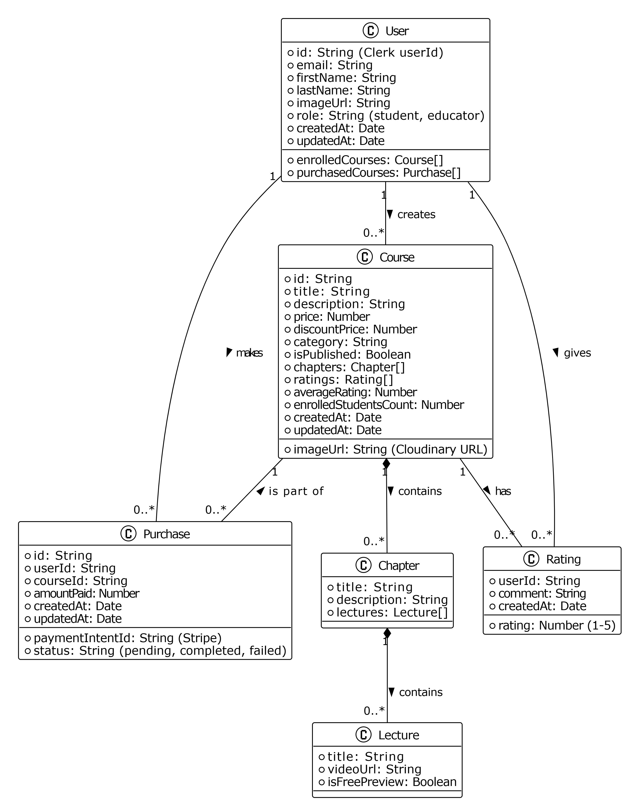

# 📚 LMS Backend

This repository houses the robust backend infrastructure for the Learning Management System (LMS) application. Built using the **MERN stack** (MongoDB, Express.js, Node.js), it provides core functionalities including user authentication via Clerk, course management, Stripe payment integration, and RESTful APIs for both learners and educators.

---

## 📑 Table of Contents

- [Features](#features)
- [Class Diagram](#class-diagram)
- [Technologies Used](#technologies-used)
- [Folder Structure](#folder-structure)
- [Setup and Installation](#setup-and-installation)
  - [Prerequisites](#prerequisites)
  - [Environment Variables](#environment-variables)
  - [Running the Application](#running-the-application)
- [API Endpoints](#api-endpoints)
  - [Authentication (Clerk Webhooks)](#authentication-clerk-webhooks)
  - [Educator APIs](#educator-apis)
  - [Course APIs](#course-apis)
  - [User APIs](#user-apis)
- [Database Schema](#database-schema)
- [Deployment](#deployment)
- [Contributing](#contributing)

---

## Class Diagram



## ✅ Features

- **User Authentication & Management** with Clerk
- **Role-Based Access Control** for students and educators
- **Course Management**: Create, update, and structure courses with chapters and lectures
- **Free Preview Support** for selected lectures
- **Stripe Payment Integration** for secure checkout
- **Cloud Storage** via Cloudinary for thumbnails
- **MongoDB Atlas** for scalable NoSQL database
- **Progress Tracking** for lectures
- **RESTful APIs** for full frontend/backend interaction

---

## 🛠 Technologies Used

- **Node.js**
- **Express.js**
- **MongoDB + Mongoose**
- **Clerk**
- **Stripe**
- **Cloudinary**
- **Multer**
- **CORS**
- **Dotenv**
- **Nodemon**
- **SVX** (for Clerk webhooks)

---

## 📁 Folder Structure

```

.
├── config/
│   ├── cloudinary.js
│   └── mongodb.js
├── controllers/
│   ├── courseController.js
│   ├── educatorController.js
│   ├── userController.js
│   └── webhooks.js
├── middlewares/
│   └── authMiddleware.js
├── models/
│   ├── course.js
│   ├── purchase.js
│   └── user.js
├── routes/
│   ├── courseRoutes.js
│   ├── educatorRoutes.js
│   └── userRoutes.js
├── .env
├── .gitignore
├── package.json
├── server.js
└── vercel.json

```

---

## ⚙️ Setup and Installation

### 🔑 Prerequisites

- Node.js v14+
- MongoDB Atlas account
- Clerk account
- Cloudinary account
- Stripe account
- Postman or API testing tool

### 🧪 Environment Variables

Create a `.env` file:

```

MONGODB\_URI=your\_mongodb\_uri
CLERK\_WEBHOOK\_SECRET=your\_clerk\_webhook\_secret
CLERK\_PUBLISHABLE\_KEY=your\_clerk\_publishable\_key
CLERK\_SECRET\_KEY=your\_clerk\_secret\_key
CLOUDINARY\_NAME=your\_cloudinary\_name
CLOUDINARY\_API\_KEY=your\_cloudinary\_api\_key
CLOUDINARY\_SECRET\_KEY=your\_cloudinary\_secret\_key
STRIPE\_SECRET\_KEY=your\_stripe\_secret\_key
STRIPE\_WEBHOOK\_SECRET=your\_stripe\_webhook\_secret
PORT=5000

````

> ⚠️ Never commit your `.env` file to version control.

---

### 🚀 Running the Application

```bash
cd server
npm install
npm run server
````

Visit: [http://localhost:5000](http://localhost:5000)

---

## 📡 API Endpoints

All routes are prefixed with `/api`.

### 🔐 Authentication (Clerk Webhooks)

| Method | Endpoint | Description                 |
| ------ | -------- | --------------------------- |
| POST   | `/clerk` | Handle Clerk webhook events |

---

### 👨‍🏫 Educator APIs

| Method | Endpoint                      | Description                         |
| ------ | ----------------------------- | ----------------------------------- |
| GET    | `/educator/update-role`       | Upgrade user to educator            |
| POST   | `/educator/add-course`        | Add a new course                    |
| GET    | `/educator/courses`           | Get all courses by educator         |
| GET    | `/educator/dashboard`         | Educator statistics and earnings    |
| GET    | `/educator/enrolled-students` | Get list of students with purchases |

---

### 📘 Course APIs

| Method | Endpoint      | Description               |
| ------ | ------------- | ------------------------- |
| GET    | `/course/all` | Get all published courses |
| GET    | `/course/:id` | Get course by ID          |

---

### 👤 User APIs

| Method | Endpoint                        | Description                  |
| ------ | ------------------------------- | ---------------------------- |
| GET    | `/user/data`                    | Get user profile             |
| GET    | `/user/enrolled-courses`        | Get user's enrolled courses  |
| POST   | `/user/update-course-progress`  | Update lecture progress      |
| POST   | `/user/add-rating`              | Submit course rating         |
| POST   | `/user/create-checkout-session` | Initiate Stripe checkout     |
| POST   | `/user/webhook`                 | Handle Stripe webhook events |

---

## 🧩 Database Schema

* **User**: Clerk ID, roles, profile data
* **Course**: Chapters, lectures, ratings, educator ID
* **Purchase**: User ID, course ID, amount

---

## ☁️ Deployment (Vercel)

1. Connect GitHub to Vercel
2. Set the root directory to `/server`
3. Add environment variables in Vercel
4. Deploy — automatic CI/CD enabled

---

## 🤝 Contributing

We welcome contributions!

```bash
# Fork and clone
git checkout -b feature/your-feature
# Make changes
git commit -m "feat: Your feature"
git push origin feature/your-feature
# Create a pull request
```
