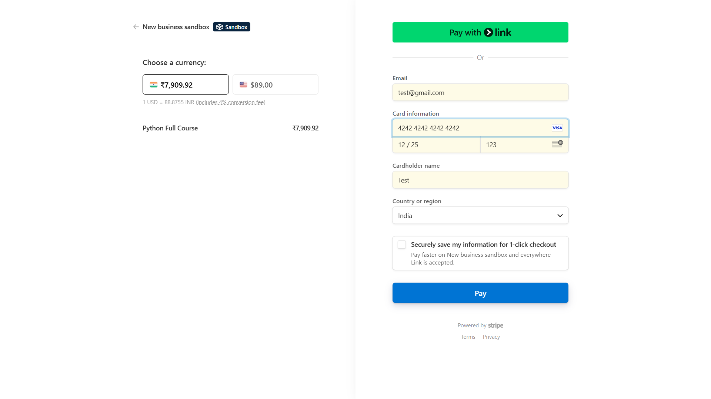
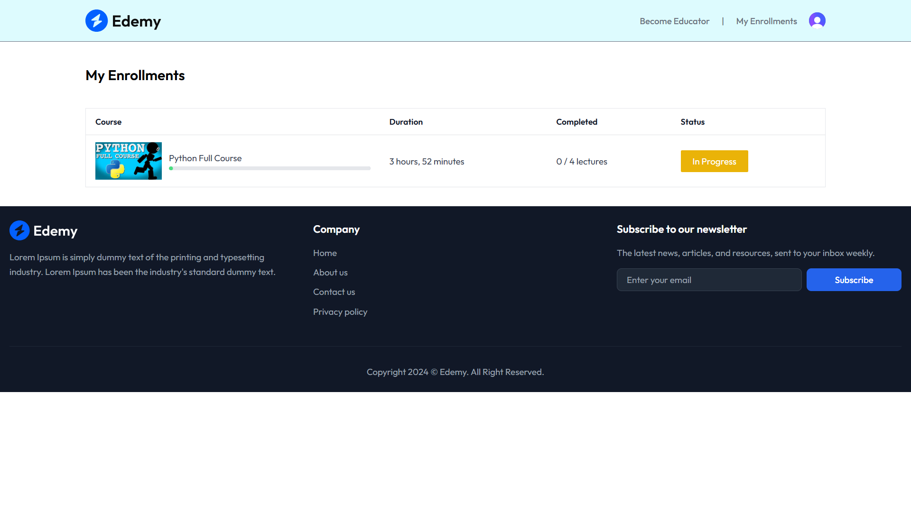
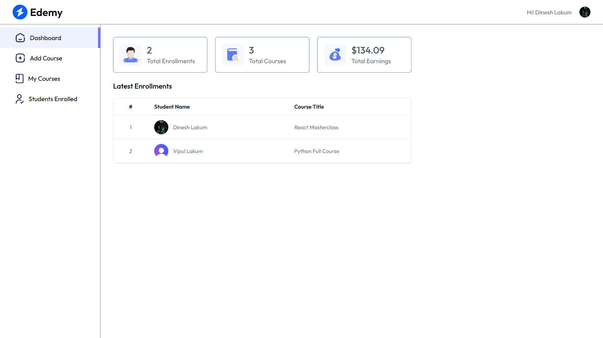
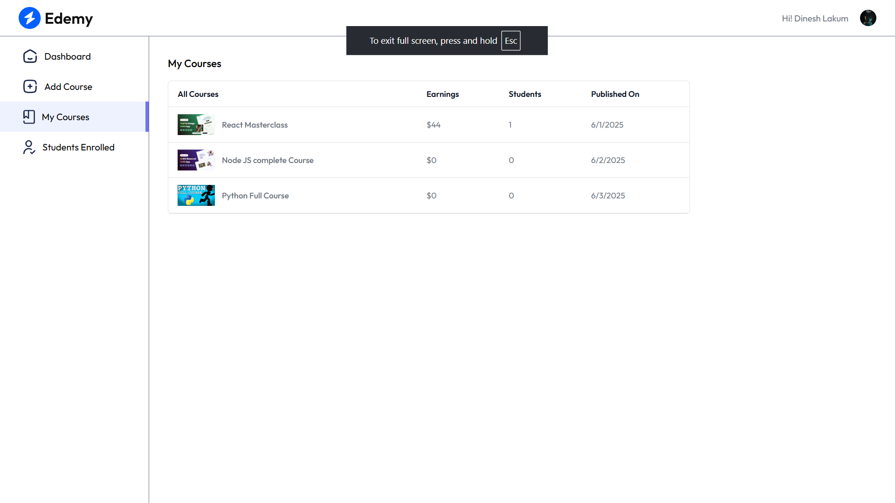
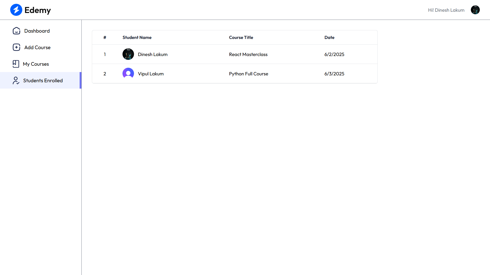
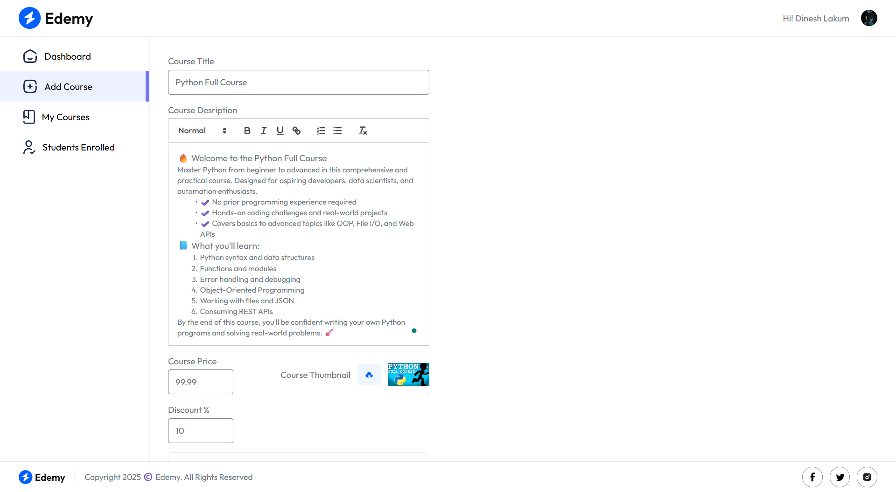

# 🎓 LMS Frontend

This repository contains the **user interface** for the Learning Management System (LMS) application. Built with **React.js** and styled using **Tailwind CSS**, it provides a responsive and dynamic experience for both students and educators. The frontend interacts seamlessly with backend APIs for authentication, course management, and payments.

---


## 📚 Table of Contents

- [Features](#features)
- [Technologies Used](#technologies-used)
- [Folder Structure](#folder-structure)
- [Setup and Installation](#setup-and-installation)
  - [Prerequisites](#prerequisites)
  - [Environment Variables](#environment-variables)
  - [Running the Application](#running-the-application)
- [API Interactions](#api-interactions)
- [Deployment](#deployment)
- [Contributing](#contributing)

---

## ✅ Features

- **Responsive Design**: Optimized for desktop, tablet, and mobile.
- **Homepage**:
  - Navigation bar
  - Course search box
  - Course cards and testimonials
  - Footer with contact and links


- **Course Description Page**:
  - Course overview, rating, enrolled students, and outline
  - Free lecture preview support


- **User Authentication**:
  - Seamless login/signup with Clerk


- **Course Enrollment**:
  - Secure Stripe checkout integration



- **Progress Tracking**:
  - Track completed lectures in enrolled courses



- **Educator Dashboard**:
  - Add/manage courses and view enrollments

### Dashboard



### My Courses



### Students Enrolled



### Add Course



---

## 🛠 Technologies Used

- **React.js**
- **Clerk** (Authentication)
- **Tailwind CSS** (Styling)
- **Stripe.js** (Payment)
- **Axios** (HTTP client)
- **React Router**
- **Vite** (Build tool)

---

## 📁 Folder Structure

```

.
├── public/                 # Static assets
├── src/
│   ├── assets/             # Images, icons, etc.
│   ├── components/         # Reusable components (Navbar, Footer, etc.)
│   ├── pages/              # Views/pages (Home, CourseDetails, Auth, etc.)
│   ├── hooks/              # Custom hooks
│   ├── context/            # Global state (AppContext)
│   ├── utils/              # Utility functions
│   ├── App.js
│   ├── index.js
│   └── main.jsx            # Vite entry file
├── .env.local              # Environment variables (ignored in .gitignore)
├── .gitignore
├── package.json
└── tailwind.config.js

````

---

## ⚙️ Setup and Installation

### 🔑 Prerequisites

- Node.js (v14+)
- npm or Yarn

---

### 🔐 Environment Variables

Create a `.env.local` file in the root and add:

```env
VITE_APP_BACKEND_URL=your_backend_url
VITE_APP_CLERK_PUBLISHABLE_KEY=your_clerk_key
VITE_APP_STRIPE_PUBLISHABLE_KEY=your_stripe_key
````

---

### 🚀 Running the Application

```bash
cd frontend
npm install       # or yarn install
npm run dev       # or yarn dev
```

Frontend will typically run at: [http://localhost:5173](http://localhost:5173)

---

## 📡 API Interactions

* **User Management**: Sign up, login, profile (via Clerk)
* **Course Data**: List courses, fetch course details
* **Educator Operations**: Add courses, manage lectures, view enrolled students
* **Student Operations**:

  * Enroll in courses
  * Track lecture completion
  * Submit course ratings
  * Purchase via Stripe checkout

---

## ☁️ Deployment

1. Push the project to GitHub.
2. Connect it to [Vercel](https://vercel.com).
3. Choose `frontend/` as the root directory.
4. Add all environment variables from `.env.local` to Vercel dashboard.
5. Deploy 🚀

---

## 🤝 Contributing

We welcome contributions!

```bash
# Fork the repository
# Create a feature branch
git checkout -b feature/your-feature

# Make changes and commit
git commit -m "feat: Add new component"

# Push and open a PR
git push origin feature/your-feature
```
